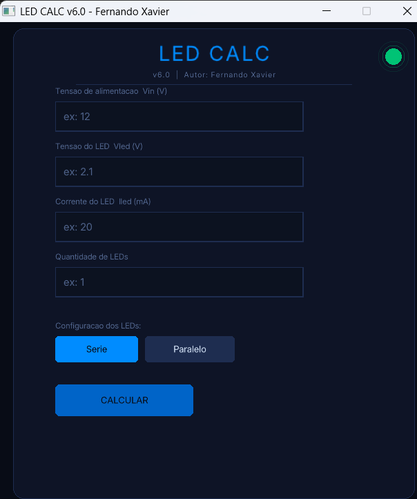

LED CALC v6.0

Aplicação em C com interface gráfica (Raylib) para cálculo de resistores em circuitos com LEDs.

O sistema calcula automaticamente o resistor ideal com base na Lei de Ohm, sugere valores comerciais da série E12, analisa a potência dissipada e propõe combinações de resistores.

📸 Interface
## 📸 Interface

🚀 Funcionalidades
Entrada de:
Tensão de alimentação (Vin)
Tensão do LED (Vled)
Corrente do LED (Iled)
Quantidade de LEDs
Configuração:
Série ou paralelo
Cálculos:
Resistor ideal
Resistor comercial mais próximo (E12)
Erro percentual
Combinações:
Série
Paralelo
Mista (2 ou 3 resistores)
Análise de potência:
Dissipação
Margem de segurança (2x)
Exportação:
Resultado salvo em resultado_led.txt
🧠 Como funciona

O cálculo do resistor é baseado na Lei de Ohm:

R = (Vin - Vled_total) / I

Onde:

Vin → tensão de entrada
Vled_total → soma das tensões dos LEDs
I → corrente desejada

Também são calculados:

Potência dissipada:

P = V * I
Sugestão de resistor com margem de segurança para evitar superaquecimento
🧱 Estrutura do Projeto
led_calc/
├── main.c               ← ponto de entrada
├── core/
│   ├── calc.h           ← structs e funções de cálculo
│   └── calc.c           ← lógica (E12, combinações, potência)
├── interface/
│   ├── ui.h             ← componentes da UI
│   └── ui.c             ← interface gráfica (Raylib)
└── README.md
⚙️ Tecnologias
Linguagem C
Raylib (interface gráfica)
GCC / MinGW
📦 Instalação do Raylib
Linux (Ubuntu/Debian)
sudo apt install libraylib-dev
Windows
Baixe: https://github.com/raysan5/raylib/releases
Extraia em: C:\raylib
Verifique se existem as pastas:
include
lib
macOS
brew install raylib
🛠️ Compilação
Linux
gcc main.c core/calc.c interface/ui.c -o led_calc -lraylib -lGL -lm -lpthread -ldl -lrt -lX11
Windows (MinGW)
gcc main.c core/calc.c interface/ui.c -o led_calc.exe -I C:\raylib\include -L C:\raylib\lib -lraylib -lopengl32 -lgdi32 -lwinmm -lm
macOS
gcc main.c core/calc.c interface/ui.c -o led_calc -lraylib -lm -framework OpenGL -framework Cocoa -framework IOKit
▶️ Executar
Linux / macOS
./led_calc
Windows
led_calc.exe
📌 Roadmap (próximas melhorias)
 Interface mais responsiva
 Suporte a mais séries de resistores (E24, E96)
 Gráficos de consumo
 Versão web
 Exportação em PDF
📄 Licença

Este projeto está sob a licença MIT.

👨‍💻 Autor

Fernando Xavier
